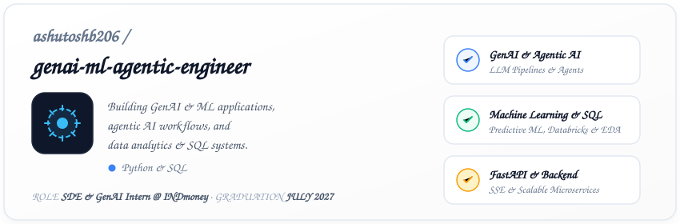
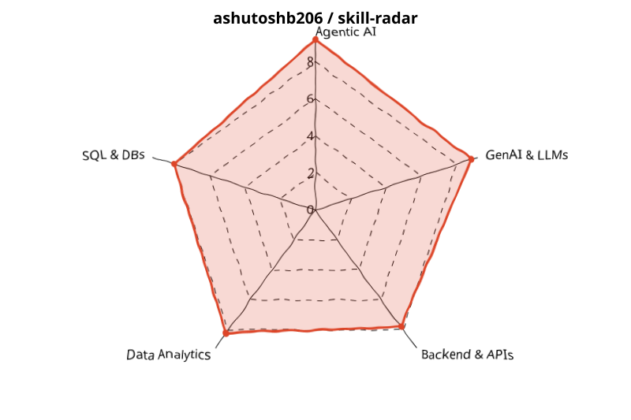
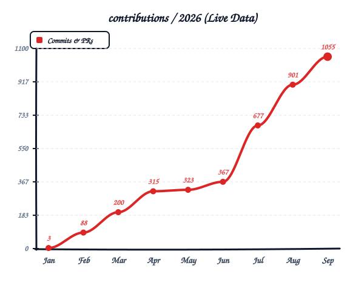

  <!-- Custom Profile Banner Card -->
  

    

  <!-- Side-by-Side Hand-Drawn Charts Row (width 45% guarantees side-by-side rendering) -->
  

    
    &nbsp;&nbsp;
    
  

   

  <!-- Contact Badges -->
  

    
    &nbsp;&nbsp;
    
    &nbsp;&nbsp;
    
  

---

### About

Pre-final year B.Tech CSE student at **Manipal Institute of Technology, Bengaluru** (CGPA: 7.98). Currently an **SDE & GenAI Intern at INDmoney**, building KYC infrastructure and production LLM pipelines. Specializing in **GenAI, Machine Learning, Agentic AI systems**, and data-driven backends.

---

### Experience

- **INDmoney** — *SDE & GenAI Intern* `May 2026 – Present`  
  Architected NRI bank statement extraction pipeline using MarkItDown & Gemma 4B. Boosted KYC extraction accuracy by 8–10% across 5 document types via LLM prompt optimization; improved OCR accuracy by 8%.

---

### Featured Projects

- 🌐 **[Raaha](https://raaha.vercel.app)** — Connectivity-aware navigation platform using cellular signal strength as a routing variable, featuring H3 spatial indexing, Predictive Deadzone Caching, and a trained GAT encoder + PPO RL agent.
- 🤖 **AI Release Testing Agent** — Automated release validation agent with 3-provider LLM routing (Groq, Anthropic, Ollama) that generates Playwright test suites from code diffs with an SSE-streamed React dashboard.
- 📄 **Document Intelligence RAG** — Hybrid dense+sparse FAISS retrieval over 100+ PDFs with citation-grounded LLM response generation, reducing query latency by ~30%.

---

### Tech Stack

- **GenAI / LLMs**: `RAG` · `Prompt Engineering` · `Fine-Tuning` · `Vector DBs` · `Anthropic API` · `Groq` · `Ollama` · `Gemma`
- **Agentic AI**: `LangChain` · `LangGraph` · `AutoGen` · `CrewAI` · `Multi-Agent Orchestration` · `Tool Use`
- **Data Analytics & ML**: `Machine Learning` · `SQL` · `Pandas` · `NumPy` · `ETL Pipelines` · `Power BI` · `Databricks` · `EDA`
- **Backend & APIs**: `FastAPI` · `Python` · `REST APIs` · `SSE` · `Node.js` · `PostgreSQL`
- **Tools & Infra**: `Docker` · `Git` · `Bitbucket` · `Railway` · `Vercel` · `Cursor` · `Claude Code` · `New Relic`
